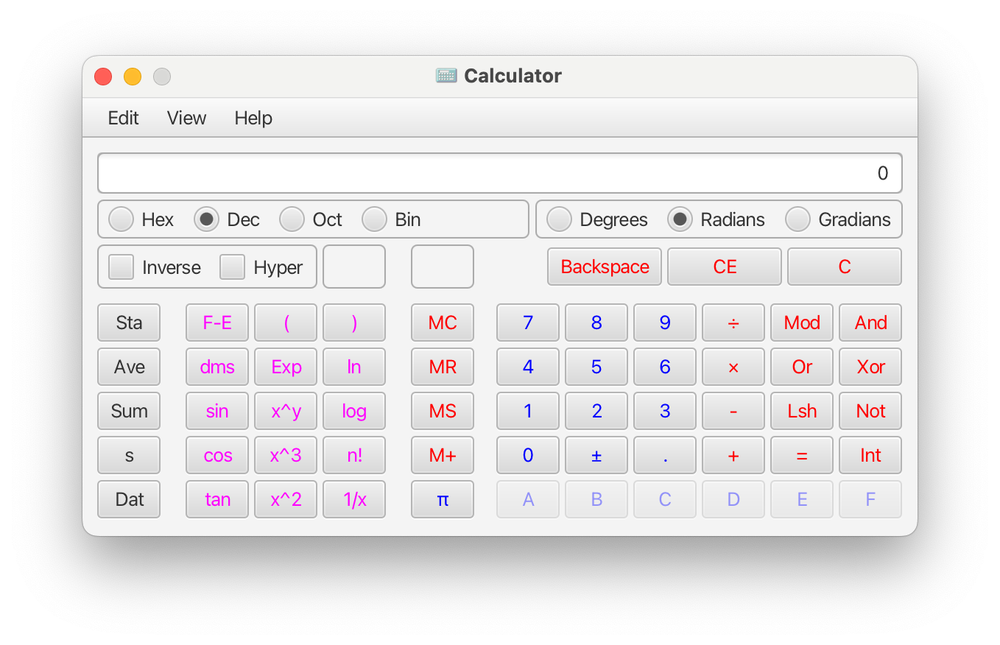

# Rewrite of Microsoft Calculator in JavaFX

:construction: Project under construction :construction:



Engine source code was translated from the official Calculator repository: https://github.com/microsoft/calculator

Current project status:

- [X] Engine code translated from C++ to Java, together with unit tests
- [X] Fully working scientific view
- [ ] Standard view
- [ ] Statistics box
- [ ] UI based tests
- [ ] Improve translated code quality by refactoring
- [ ] Add About box
- [ ] Test on Linux and Windows

JDK required to run this project is: 21.

### How to run application
```
./mvnw javafx:run -pl gui
```

### How to rebuild `.css` files from `.scss`
```
./mvnw nl.geodienstencentrum.maven:sass-maven-plugin:update-stylesheets -pl gui
```

### How to watch for SCSS changes and regenerate them when they change
```
fswatch --exclude='.*' --include='.*[.]scss$' --print0 . | while read -d "" event; do
    ./mvnw nl.geodienstencentrum.maven:sass-maven-plugin:update-stylesheets -pl gui 
done
```
You need to install `fswatch` command for this to work.

### How to generate `jlink` image
```
./mvnw javafx:jlink -pl gui 
```
You can now send `./gui/target/gui.zip` to your friends :tada:

### How to run integration tests (TestFX)
```
./mvnw verify -Dskip.integration.tests=false -Dskip.unit.tests=true
```

### How to run single integration test
```
./mvnw clean verify -Dskip.integration.tests=false -Dskip.unit.tests=true \
    -pl gui -Dit.test=MainWindowIT
```

### How to run integration tests in the headless mode
```
_JAVA_OPTIONS="-Djava.awt.headless=true \
-Dtestfx.robot=glass \
-Dtestfx.headless=true \
-Dprism.order=sw \
-Dprism.verbose=true" ./mvnw verify -Dskip.integration.tests=false -pl gui 
```

On macOS you must allow IntelliJ or the terminal app that you are using,
to "take over your computer":


